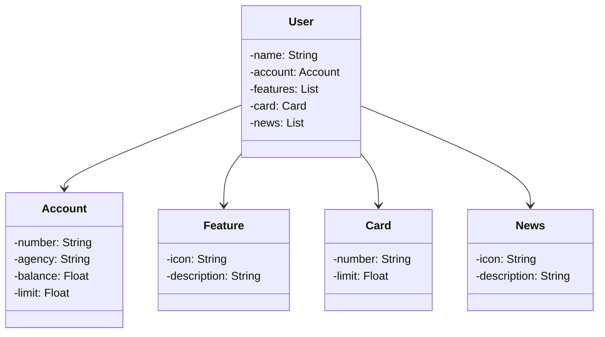

# Publicando Sua API REST na Nuvem Usando Spring Boot 3, Java 17 e Railway

- Projeto para a conclusão do curso Backend Java pelo Bootcamp Santander

## Diagrama de Classes

```mermaid
classDiagram
  class User {
    -name: String
    -account: Account
    -features: List<Feature>
    -card: Card
    -news: List<News>
  }
  
  class Account {
    -number: String
    -agency: String
    -balance: Float
    -limit: Float
  }
  
  class Feature {
    -icon: String
    -description: String
  }
  
  class Card {
    -number: String
    -limit: Float
  }
  
  class News {
    -icon: String
    -description: String
  }

  User --> Account
  User --> Feature
  User --> Card
  User --> News
```
