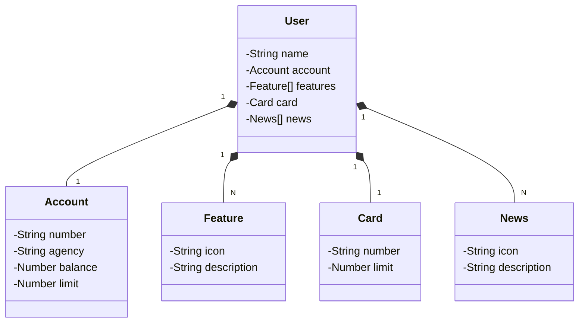

# API REST na Nuvem Usando Spring Boot 3, Java 17 e Railway

Projeto final do Bootcamp Santander Backend Java pela DIGITAL INNOVATION ONE 

## Principais Tecnologias
 -  Modificações feitas no README e no código fonte para o projeto final do Bootcamp Santander pela DIO. 

## [Link do Figma](https://www.figma.com/file/0ZsjwjsYlYd3timxqMWlbj/SANTANDER---Projeto-Web%2FMobile?type=design&node-id=1421%3A432&mode=design&t=6dPQuerScEQH0zAn-1)

O Figma foi utilizado para a abstração do domínio desta API, conforme aula final.

## Diagrama de Classes (Domínio da API)

- Diagrama de Classes, feito na plataforma JSON manualmente. 

## Documentação da API (Swagger)

### [https://sdw-2023-prd.up.railway.app/swagger-ui.html](https://sdw-2023-prd.up.railway.app/swagger-ui.html)

